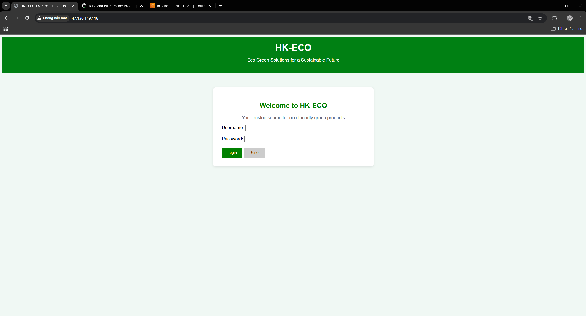
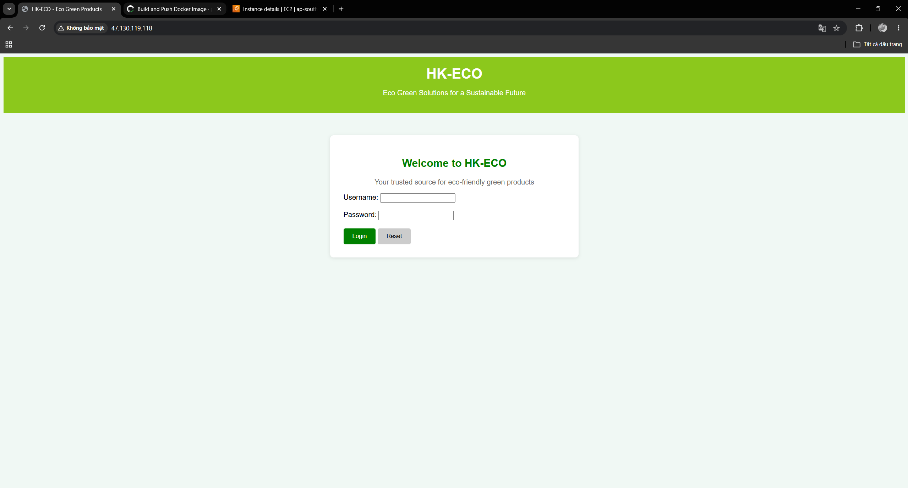
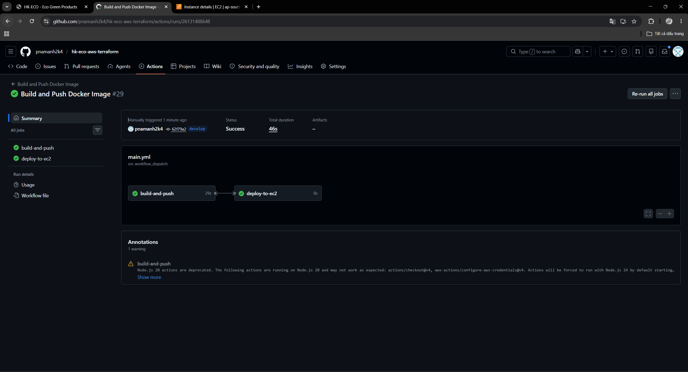

# HK-ECO

Project cá nhân học DevOps: web tĩnh chạy trên AWS, hạ tầng dựng bằng Terraform, deploy bằng GitHub Actions.

**Luồng chạy:** sửa code → Git tag → Actions build Docker → push ECR → SSH vào EC2 chạy container (port 80).

## Dùng gì

- Terraform (VPC, EC2, ECR, IAM…)
- Docker + GitHub Actions
- AWS: EC2, ECR, ap-southeast-1

## Chạy Terraform (lần đầu)

```bash
cp terraform.tfvars.example terraform.tfvars   # rồi sửa cho đúng
# đặt file public key: keypair/HK-ECO-key.pub (private key không commit)

terraform init
terraform apply
terraform output instance_ip_addr_public
```

Cấu hình GitHub Secrets: `AWS_ACCESS_KEY_ID`, `AWS_SECRET_ACCESS_KEY`, `EC2_PUBLIC_IP`, `EC2_SSH_KEY`.

Sau `terraform destroy` rồi `apply` lại thì **đổi IP** → nhớ cập nhật `EC2_PUBLIC_IP`.

## Đổi web / deploy bản mới

```bash
git add web/index.html
git commit -m "update web"
git push

git tag v1.0.2          # tag mới mỗi lần đổi (đã commit trước!)
git push origin v1.0.2
```

GitHub → **Actions** → **Run workflow** → nhập `v1.0.2`.

Quay bản cũ: Run workflow với tag cũ (vd. `v1.0.0`).

> Tag trỏ commit cũ thì image vẫn là giao diện cũ — đừng quên commit trước khi tạo tag.

## Demo

- Web live: `http://<IP-EC2>/` (khi máy đang bật)

**Trang web**





**GitHub Actions**



## Ghi chú nhanh

- EC2 là Amazon Linux → SSH user `ec2-user`
- `runs-on: ubuntu-latest` là máy GitHub chạy CI, không phải EC2